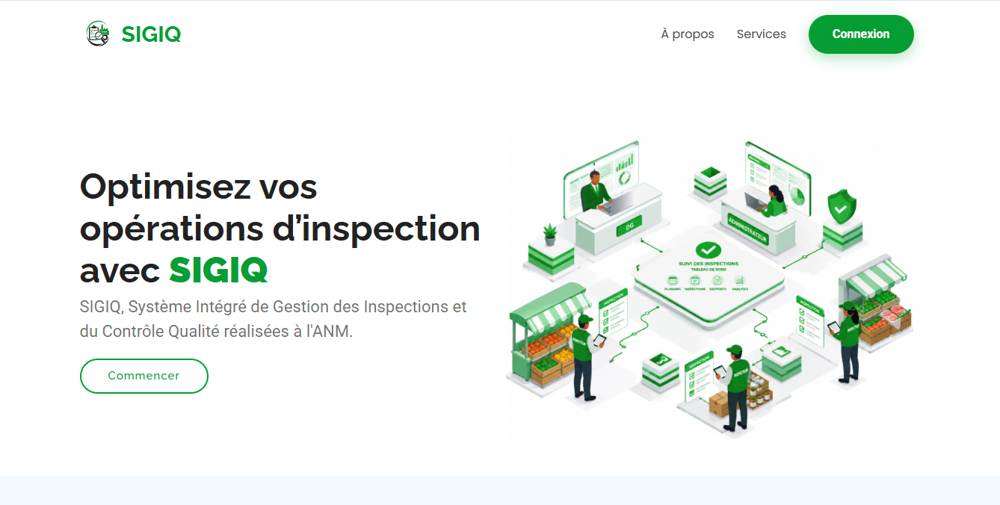
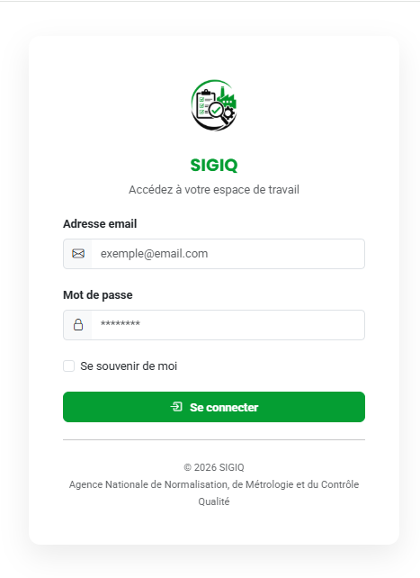
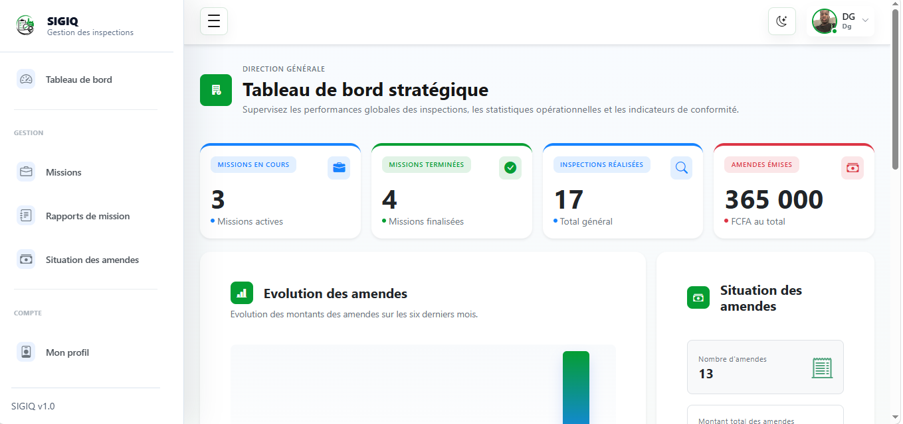
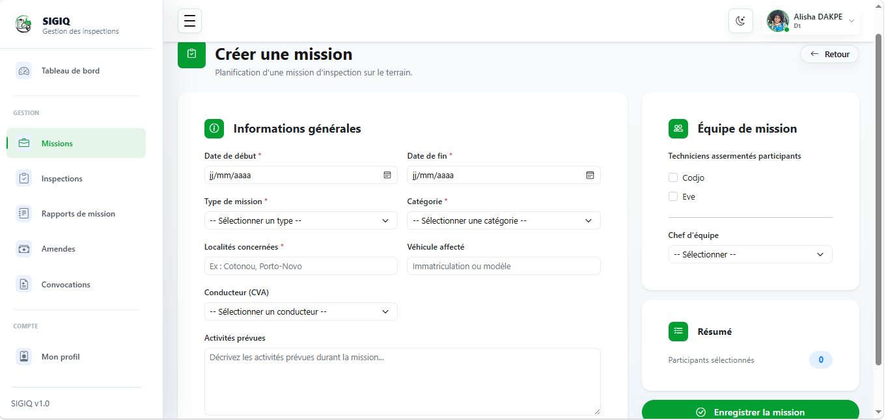
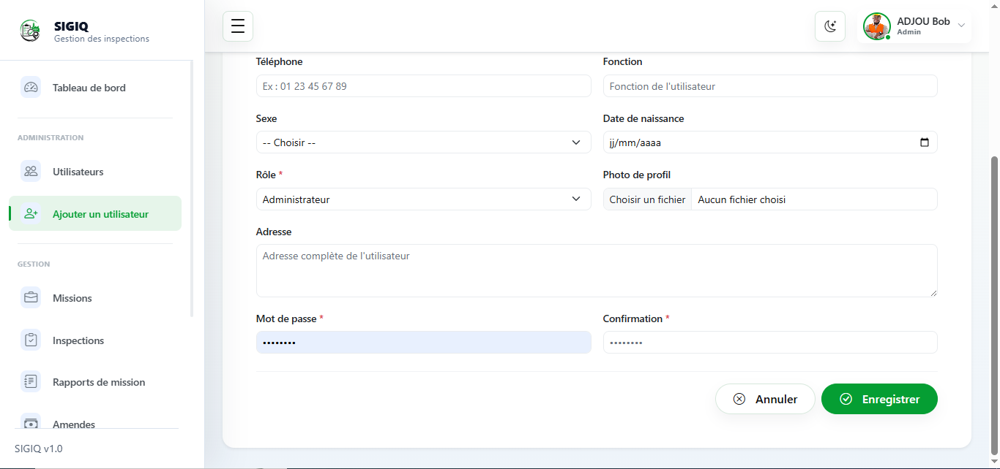
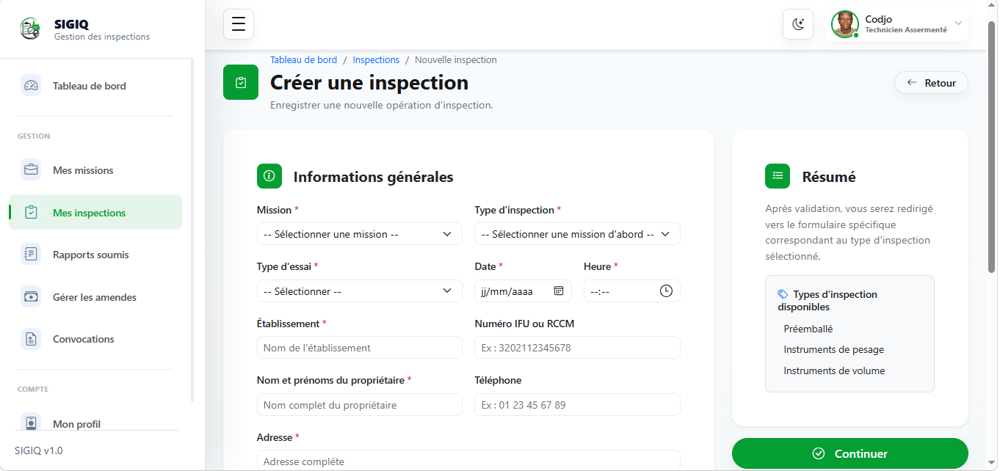
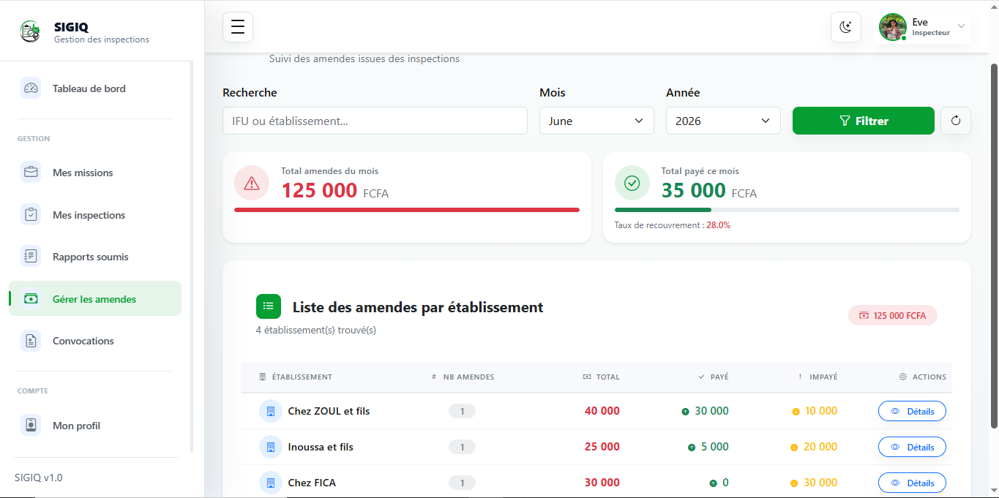
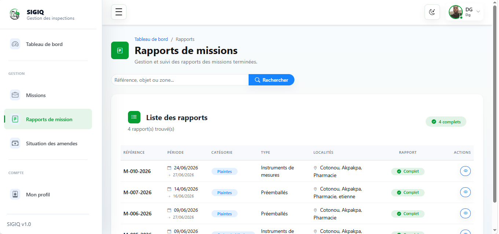
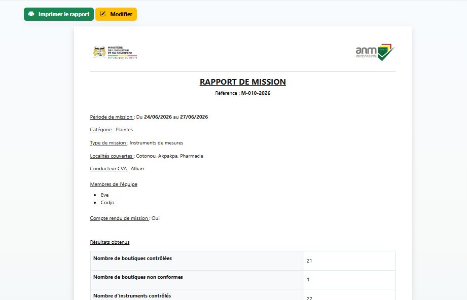
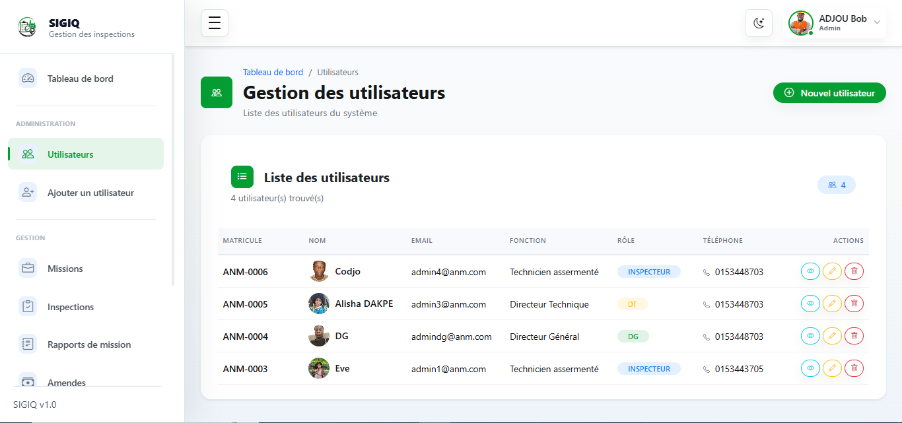

# SIGIQ — Système Intégré de Gestion des Inspections et du Contrôle Qualité

> Plateforme web de digitalisation et de suivi des missions d’inspection et des opérations de contrôle qualité.


---

## 📌 Présentation

**SIGIQ** (Système Intégré de Gestion des Inspections et du Contrôle Qualité) est une application web conçue pour faciliter la gestion et le suivi des missions d’inspection.

L'application permet de centraliser les informations relatives aux missions, aux équipes d'inspection, aux entreprises contrôlées, aux inspections réalisées et aux rapports générés.

Elle a été développée dans le cadre d'un projet académique et constitue également une étude de cas démontrant la mise en œuvre d'une application métier avec Laravel.

---

## 🎯 Problématique

Le suivi des missions d'inspection peut être confronté à plusieurs difficultés lorsque les informations sont gérées principalement sur support papier ou à travers plusieurs outils :

* difficulté de centraliser les informations ;
* suivi manuel des missions ;
* dispersion des données ;
* difficulté à retrouver l'historique des inspections ;
* production manuelle de certains documents ;
* manque de visibilité sur l'état d'avancement des missions.

**SIGIQ propose une solution numérique permettant de centraliser et de structurer ces différents processus.**

---

## 💡 Solution proposée

SIGIQ permet aux différents utilisateurs de gérer les principales étapes du processus d'inspection depuis une interface web centralisée.

La plateforme permet notamment de :

* créer et gérer des missions ;
* affecter les membres des équipes aux missions ;
* définir un chef d'équipe ;
* consulter les missions assignées ;
* enregistrer les inspections ;
* suivre l'état des inspections ;
* générer des rapports ;
* générer des convocations avec QR code ;
* gérer les amendes et leurs justificatifs ;
* consulter des tableaux de bord statistiques ;
* administrer les utilisateurs et leurs accès.

---

## 👥 Gestion des utilisateurs

L'application prend en charge plusieurs profils utilisateurs :

| Rôle                    | Principales responsabilités                                        |
| ----------------------- | ------------------------------------------------------------------ |
| **Administrateur**      | Gestion des utilisateurs, rôles et accès                           |
| **Directeur Général**   | Consultation et suivi global                                       |
| **Directeur Technique** | Création et gestion des missions                                   |
| **Inspecteur**          | Consultation des missions assignées et réalisation des inspections |

Les droits d'accès sont adaptés au rôle de chaque utilisateur.

---

## ⚙️ Fonctionnalités principales

### 🔐 Authentification et gestion des accès

* Connexion sécurisée
* Gestion des rôles
* Activation et désactivation des comptes
* Gestion des utilisateurs
* Réinitialisation des mots de passe

### 📋 Gestion des missions

* Création de missions
* Définition du type de mission
* Définition de la période
* Définition des localités concernées
* Affectation des inspecteurs
* Désignation du chef d'équipe
* Suivi des missions

### 🔎 Gestion des inspections

Les inspecteurs peuvent consulter leurs missions et enregistrer les informations relatives aux inspections effectuées.

Les principaux types d'inspection pris en compte comprennent notamment :

* Pesage
* Volume
* Produits préemballés

### 📄 Gestion des rapports

SIGIQ permet de centraliser les informations nécessaires à la production des rapports d'inspection.

Les rapports sont associés aux missions et aux inspections correspondantes afin de faciliter leur suivi et leur consultation.

### 📱 QR Codes

Des QR codes peuvent être associés à certains documents générés par la plateforme, notamment :

* convocations ;
* justificatifs liés aux amendes.

### 💰 Gestion des amendes

La plateforme permet d'enregistrer les informations relatives aux amendes et de générer un justificatif contenant les informations nécessaires ainsi qu'un QR code.

### 📊 Tableau de bord

Les tableaux de bord permettent de visualiser différents indicateurs liés à l'activité de la plateforme :

* nombre de missions ;
* inspections ;
* utilisateurs ;
* états des missions ;
* autres statistiques disponibles selon le profil.

---

## 🛠️ Technologies utilisées

### Backend

* **PHP 8.2**
* **Laravel 12**

### Base de données

* **MySQL**

### Frontend

* **HTML5**
* **CSS3**
* **Bootstrap**
* **JavaScript**

### Outils

* **Git**
* **GitHub**
* **Composer**
* **Vite**

---

## 🏗️ Architecture

L'application repose sur l'architecture **MVC (Model-View-Controller)** proposée par Laravel.

```text
SIGIQ
│
├── app/
│   ├── Models/
│   ├── Http/
│   │   ├── Controllers/
│   │   └── Requests/
│   └── ...
│
├── database/
│   ├── migrations/
│   └── seeders/
│
├── resources/
│   ├── views/
│   ├── css/
│   └── js/
│
├── routes/
│   └── web.php
│
├── public/
├── storage/
├── tests/
├── composer.json
└── README.md
```

---

## 🚀 Installation

### Prérequis

Avant d'installer SIGIQ, assurez-vous d'avoir :

* PHP >= 8.2
* Composer
* MySQL
* Node.js et npm
* Git

### 1. Cloner le projet

```bash
git clone https://github.com/Ziyade001/SIGIQ.git
```

### 2. Accéder au projet

```bash
cd SIGIQ
```

### 3. Installer les dépendances PHP

```bash
composer install
```

### 4. Installer les dépendances JavaScript

```bash
npm install
```

### 5. Configurer l'environnement

Copier le fichier `.env.example` :

```bash
cp .env.example .env
```

Sous Windows PowerShell :

```powershell
Copy-Item .env.example .env
```

### 6. Générer la clé de l'application

```bash
php artisan key:generate
```

### 7. Configurer la base de données

Modifier les paramètres suivants dans `.env` :

```env
DB_DATABASE=sigiq
DB_USERNAME=root
DB_PASSWORD=
```

Créer ensuite la base de données `sigiq` dans MySQL.

### 8. Exécuter les migrations

```bash
php artisan migrate
```

Si des données de démonstration sont disponibles :

```bash
php artisan db:seed
```

### 9. Compiler les assets

```bash
npm run build
```

Pour le développement :

```bash
npm run dev
```

### 10. Démarrer le serveur

```bash
php artisan serve
```

L'application sera accessible à l'adresse :

```text
http://127.0.0.1:8000
```

---

## 📸 Captures d’écran

### 🏠 Page d'accueil

> Présentation de la plateforme SIGIQ et accès aux principales fonctionnalités.



### 🔐 Connexion

> Interface d'authentification permettant aux utilisateurs d'accéder à la plateforme selon leur profil.



### 📊 Tableau de bord

> Vue synthétique permettant de suivre les principales informations et statistiques de l'activité.



### 📋 Gestion des missions

> Interface dédiée à la création, à la consultation et au suivi des missions d'inspection.



### ➕ Ajout

> Formulaire permettant d'enregistrer de nouvelles informations dans la plateforme.



### 🔎 Inspection

> Interface permettant aux inspecteurs de renseigner les informations relatives aux inspections réalisées.



### 💰 Gestion des amendes

> Interface permettant d'enregistrer et de suivre les amendes liées aux opérations d'inspection.




### 📄 Liste des rapports

> Interface permettant de consulter et de suivre les rapports d'inspection enregistrés dans la plateforme.



### 📑 Rapport d'inspection

> Exemple de rapport d'inspection généré à partir des informations enregistrées dans SIGIQ.



### 👥 Gestion des utilisateurs

> Interface d'administration permettant de consulter et de gérer les utilisateurs de la plateforme.




---

## 🔒 Sécurité

Le projet intègre plusieurs mécanismes liés à la sécurité et au contrôle des accès :

* authentification ;
* gestion des rôles ;
* contrôle des accès selon le profil utilisateur ;
* protection des routes ;
* validation des données ;
* gestion sécurisée des mots de passe.

Les informations sensibles de configuration ne sont pas intégrées au dépôt grâce au fichier `.gitignore`.

---

## 📈 Objectifs du projet

SIGIQ vise principalement à :

* centraliser les données relatives aux inspections ;
* améliorer le suivi des missions ;
* faciliter l'accès à l'historique des inspections ;
* structurer la gestion des équipes ;
* réduire certaines tâches administratives manuelles ;
* faciliter la production et la consultation des documents.

---

## 🔮 Évolutions possibles

Plusieurs améliorations peuvent être envisagées :

* application mobile ;
* fonctionnement hors ligne pour les inspections sur le terrain ;
* synchronisation des données ;
* authentification à deux facteurs ;
* notifications ;
* amélioration des tableaux de bord ;
* statistiques avancées ;
* système de journalisation plus détaillé.

---

## 👨‍💻 Auteur

**Ziyade AMINOU**

Développeur Full Stack | Web • No-Code • Automatisation

**Technologies principales :** PHP • Laravel • JavaScript • MySQL • WordPress

---

## 📄 Contexte

Projet réalisé dans le cadre d'une formation en **Informatique de Gestion — Analyse Informatique et Programmation**.

SIGIQ constitue également une étude de cas présentée dans le portfolio professionnel **Z’DEV**.

---

## ⭐ Projet

Si ce projet vous intéresse, vous pouvez consulter le code source et suivre son évolution sur GitHub.
